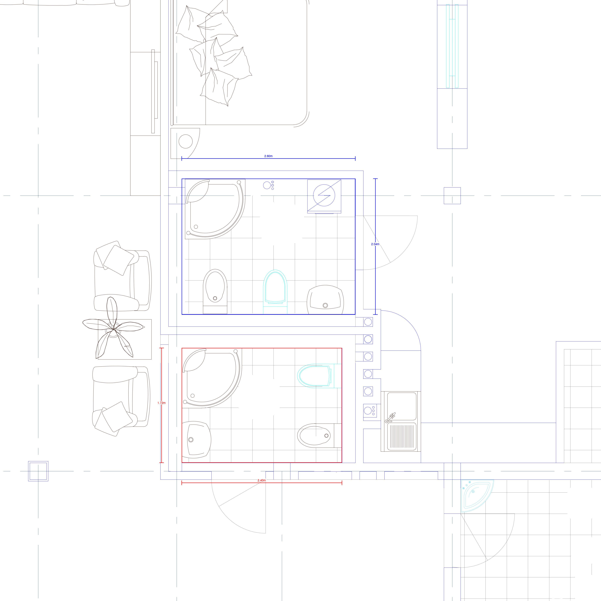
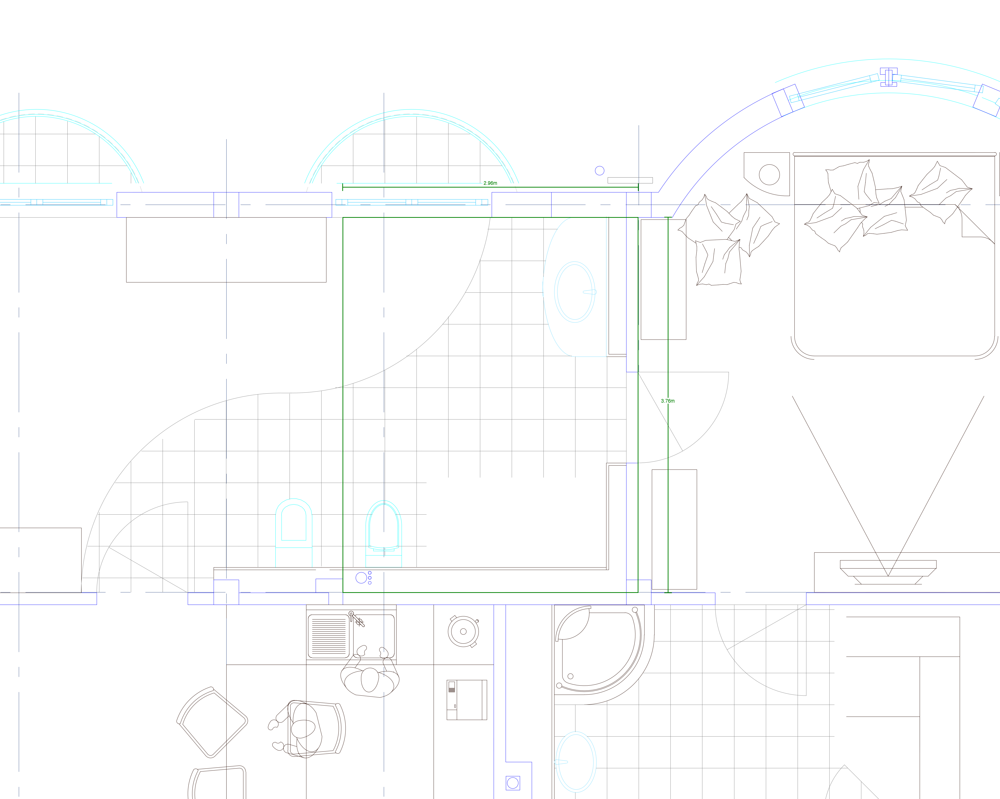

# Plan-Check

A REST API for analyzing DXF/DWG CAD drawings, extracting dimensions, annotations, and geometry, and exporting high-quality images.

## Quick Start

### 1. Setup

```bash
# Create virtual environment
python -m venv .venv
source .venv/bin/activate

# Install dependencies
pip install -r requirements.txt
```

### 2. Start the API Server

```bash
python api_server.py
```

The API will be available at `http://localhost:3000`.

### 3. Upload a Drawing

```bash
curl -X POST "http://localhost:3000/drawings" -F "file=@floor_plan.dxf"
```

### 4. Query Dimensions

```bash
curl "http://localhost:3000/drawings/{id}/dimensions"
```

### 5. Export to PNG

```bash
curl -X POST "http://localhost:3000/drawings/{id}/export" \
  -H "Content-Type: application/json" \
  -d '{"format": "png", "width": 2000}'
```

## Documentation

- `docs/API.md` - Full API documentation with all endpoints and parameters
- `docs/llm.md` - Workflow guidance for AI assistants measuring rooms

## Claude Code Skills

This project includes a Claude Code skill for querying floor plans.

### Using the Diagram Query Skill

The `diagram-query` skill is automatically available when working in this project with Claude Code. It helps answer questions about architectural drawings like:

- "What are the bathroom sizes?"
- "How big is the master bedroom?"
- "Show me the kitchen dimensions"

The skill guides Claude through the proper workflow:
1. Loading and identifying drawing regions
2. Finding room fixtures (toilets, sinks, etc.)
3. Querying wall geometry
4. Identifying correct room boundaries
5. Generating annotated measurement images

### Example: Measuring Bathroom Sizes

**Question:** "What are the bathroom sizes in this villa floor plan?"

**Process:**
1. Load the DXF file and identify floor plan regions
2. Find bathroom fixtures (WC/SANITARY layers)
3. Query wall geometry around fixtures
4. Identify enclosing walls (not just nearest walls)
5. Generate annotated measurement image

**Output:**

| Bathroom | Dimensions | Area |
|----------|------------|------|
| Bath 1 | 2.40m × 1.72m | 4.13 m² |
| Bath 2 | 2.60m × 2.04m | 5.30 m² |
| Bath 3 | 2.96m × 3.76m | 11.13 m² |

**Visual Measurements:**





### Skill Location

```
.claude/skills/diagram-query/SKILL.md
```

The skill references `docs/API.md` and `docs/llm.md` for detailed API usage and measurement best practices.

## Key Features

- **Multi-format support**: DXF and DWG files
- **Region detection**: Automatically identifies separate floor plans, elevations, etc.
- **Dimension extraction**: Extracts all dimension entities with values and positions
- **Geometry queries**: Access raw lines, arcs, circles by layer
- **Annotated exports**: Draw custom measurements and boundary rectangles on exports
- **Multiple render backends**: ezdxf (native) and LibreCAD (high quality)

## API Highlights

| Endpoint | Purpose |
|----------|---------|
| `POST /drawings` | Upload a drawing |
| `GET /drawings/{id}/regions` | Get detected diagram regions |
| `GET /drawings/{id}/dimensions` | Extract all dimensions |
| `GET /drawings/{id}/geometry` | Query raw geometry |
| `POST /drawings/{id}/export` | Export to PNG |
| `POST /drawings/{id}/export/annotated` | Export with custom measurements |

See `docs/API.md` for complete documentation.
